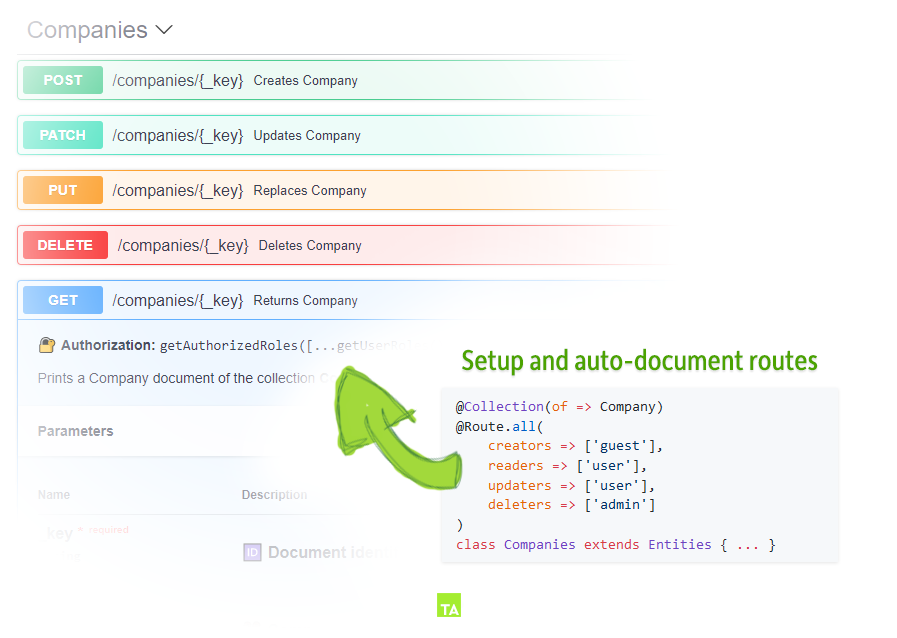

<p align="center">
  
</p>

<h5 align="center">
    Powerful decorators for <a href="https://www.arangodb.com">ArangoDB</a> <a href="https://docs.arangodb.com/3.4/Manual/Foxx/">Foxx Apps</a> when working with TypeScript.
</h5>

<p align="center">
	TypeArango creates and manages ArangoDB <code>collections</code>, <code>documents</code> and <code>routes</code> by using a single,<br/>centralized entity system which can be consumed by any <strong>backend</strong>, 
	<strong>frontend</strong>, and / or <strong>Foxx service</strong>.<br/><sub><i>Probably the world's <a href="#-worlds-fastest-way-to-create-documented-endpoints">fastest</a> way of setting up documented & schema-validated endpoints.</i></sub>
</p>


### ⭐ Features
- **Beautiful Code** thanks to decorators
- **A single Schema** for all js or ts environments
- **[Manages ArangoDB Collections](./API.md#collectionofdocument-options)** by deriving their information from entities classes
- **[Manages ArangoDB Indexes](./API.md#indextype-options)** by decorating attributes with `@Index(type, options)`
- **[Auto Schema from types](./API.md#-en-hanced-joi)** derives typing information into `joi` schemas
- **[Auto Documentation](#-worlds-fastest-way-to-create-documented-endpoints)** optimized swagger docs from types and decorators
- **[Route Decorators](./API.md#route--get-post-put-patch--delete)** for creating and documenting `Foxx.Routes` as simple as `@Route.POST(input => string())`.
- **[Attribute-based authorization](./examples/2-roles)** with `reader` and `writer` roles
- **[Route-based authorization](./API.md#routeenablecreators-readers-updaters-deleters)** with `creators`, `readers`, `updaters` and `deleters`
- **[Request-based authorization](./API.md#routeauthfunct)** on entity- or global basis
- **[CRUD like](./API.md#crud-like)** route setup with `@Route.all(roles)`
- **[Custom Routes](./API.md#route--get-post-put-patch--delete)** with input schemas and access roles
- **[Validate Input Data](./API.md#attributeschema-readers-writers)** by describing the entity or providing joi schemas for routes
- **[Internationalize document values](./API.md#-typesi18n)** and return translated strings based upon the session or a parameter
- **[Request specific attributes](./API.md#route--get-post-put-patch--delete)** only by providing a `attributes` parameter to the endpoint (like SQL SELECT)
- **[Logging integrated](./API.md#-configuration)** for an easy setup and debugging


### 💨 Shortcuts
- 🛫 **[Getting started](#-getting-started)**
- 📘 **[Tutorial Examples](./examples)**
- 📗 **[API Reference](./API.md)**


🌞 **TypeArango is in development and will receive additional features.** **Contributors wanted** 🙋

[![last-commit][github-last-commit]][github-last-commit-url]
[![version][github-version]][github-version-url]
[![npm][npm-badge]][npm-badge-url]
[![license][npm-license]][npm-license-url]
![size][shields-size]


### 📝 Example

The example will setup a User entity stored inside a Users collection with a total of 6 documented routes.

> Various other examples of how to use typeArango with certain features can be found in the 📘 **[examples](./examples)** folder.

```ts
import {
    Document, Entity, Collection, Entities, Route,
    Authorized, Index, Related, Attribute
} from 'type-arango'

// `User` document entity
@Document()
export class User extends Entity {
    @Index(type => 'hash')
    @Attribute(str => str.email())
    email: string;
    
    @Attribute()
    name: string;
    
    @Authorized(readers => ['viewer','admin'], writers => ['admin'])
    @Attribute(nr => nr.min(0).max(100))
    rating: number;
    
    @OneToMany(type => User)
    friends: Related<User[]>
}

// `Users` collection
@Collection(of => User)
@Route.all(
    creators => ['guest'],
    readers => ['user','admin'],
    writers => ['viewer','admin'],
    deleters => ['admin']
)
export class Users extends Entities {
    @Route.GET(
        path => ':id/friends',
        roles => ['viewer']
    ) static GET({req, json}: RouteArg){
        const user = Users.findOne(req.param('id'));
        return user.friends();
    }
}
```


### ⚡ Worlds fastest way to create documented endpoints

TypeArango uses the provided entity types to validate and document routes, for example a simple `@Route.all` creates five fully documented routes with a role system in place. 


<sub>*Screenshot from ArangoDBs Web Interface*</sub>


### 🛫 Getting started

#### 1. Setup ArangoDB Foxx service

If you don't have a foxx service running yet, you can create one by using 
[arangodb-typescript-setup](https://github.com/RienNeVaPlus/arangodb-typescript-setup).

> TypeArango requires ArangoDB `3.4.4` or newer.


#### 2. Install `type-arango`

```
yarn add --dev type-arango
```
or
```
npm i --save-dev type-arango
```


#### 3. Initialize TypeArango

`typeArango()` has to be called **before** the entities are imported, it returns a function to be called **after** the decorators have been applied. It takes an optional 📝 [Configuration](./API.md#-configuration) argument.

**shared/entities/index.ts**:
```ts
import typeArango from 'type-arango'

const complete = typeArango({
    // Configuration
});

export * from './user';

complete();
```


#### 4. Create routes
When using the `@Route` decorator, it is required to provide the `Foxx.Router`
to TypeArango by calling `createRoutes(router)`.

**foxx-service/main.ts**:
```ts
import createRouter from '@arangodb/foxx/router';
import {createRoutes} from 'type-arango';

// Initialize all entities before creating the routes
import * as _Entities from 'shared/entities';

// Create the foxx router and hand it to type-arango
const router = createRoutes( createRouter() );
```

As the routes are built by the `@Route.*` decorators, it is required to import all
entities before calling `createRoutes(Foxx.Router)`.


### 📚 Documentation

Read the 📘 [examples](./examples) first, then dive into the 📗 [API Reference](./API.md).


### 🌻 Credits
- type-arango is heavily inspired by [TypeORM](https://github.com/typeorm/typeorm) and [type-graphql](https://github.com/19majkel94/type-graphql).
- Avocado drawing by [FreePik](https://www.freepik.com/free-photos-vectors/background)

[github-version]: https://img.shields.io/github/package-json/v/riennevaplus/type-arango.svg
[github-version-url]: https://github.com/RienNeVaPlus/type-arango/blob/master/package.json
[github-last-commit]: https://img.shields.io/github/last-commit/riennevaplus/type-arango.svg
[github-last-commit-url]: https://github.com/RienNeVaPlus/type-arango/commits/master
[npm-badge]: https://img.shields.io/npm/v/type-arango.svg
[npm-badge-url]: https://www.npmjs.com/package/type-arango
[npm-license]: https://img.shields.io/npm/l/type-arango.svg
[npm-license-url]: https://github.com/ionic-team/stencil/blob/master/LICENSE
[shields-size]: https://img.shields.io/github/repo-size/riennevaplus/type-arango.svg
